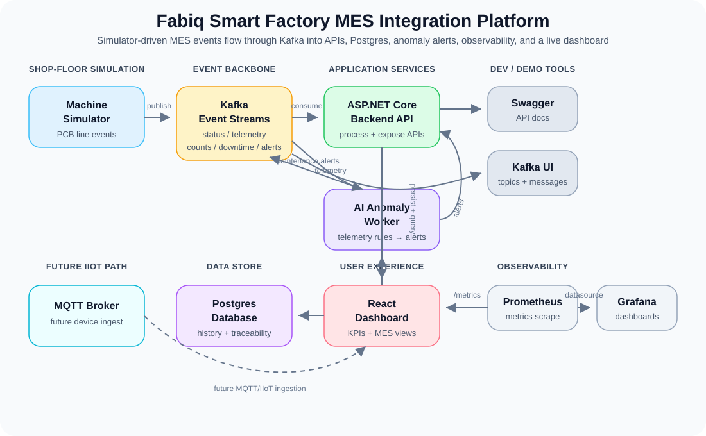
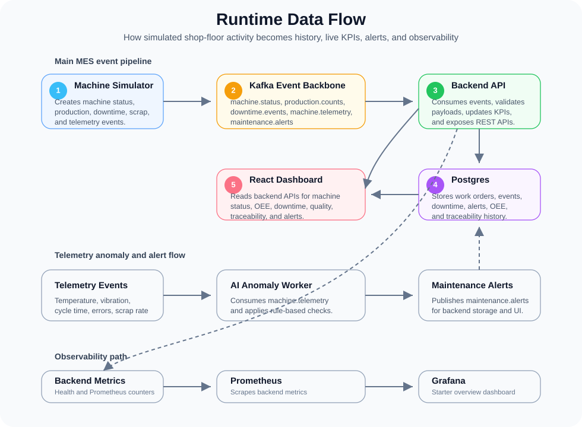
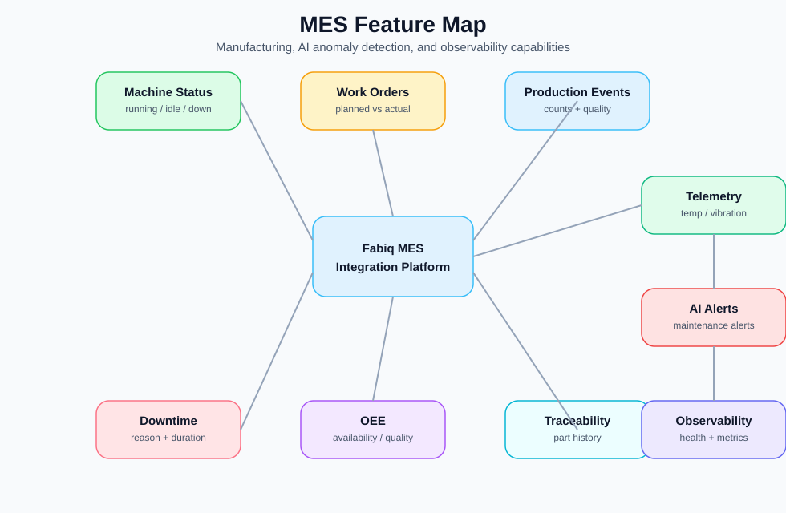
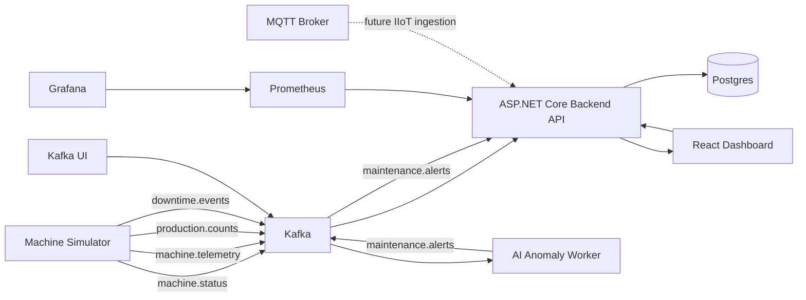

# Fabiq Smart Factory MES Integration Platform

**Version:** `v1.0.0 Portfolio MVP`
**Status:** Portfolio demo and local development project
**Domain:** Smart Manufacturing, MES, IIoT, OEE, Traceability

**Latest update:** Local orchestration improved with backend health checks, Kafka topic initialization, readiness-based Docker Compose dependencies, simulator startup retries, Prometheus/Grafana scaffolding, and optional PowerShell ON/OFF demo scripts.

Fabiq is a full-stack smart manufacturing demo that simulates a PCB/electronics production line, streams machine events through Kafka, stores manufacturing history in Postgres, and visualizes live shop-floor KPIs in a React dashboard.

It was built as portfolio evidence for smart factory, MES, IIoT, and manufacturing integration roles.

---

## Demo Preview

The demo shows a simulated PCB production line streaming manufacturing events through Kafka, storing production history in Postgres, and visualizing live MES/OEE KPIs in the React dashboard.


## Visual Overview

This project demonstrates a smart factory MES-style integration platform for a simulated PCB/electronics production line.

The main flow is:

```text
Machine Events → Kafka → Backend API → Postgres → React Dashboard
```

### System Architecture

<p align="center">
  
</p>

The simulator generates shop-floor-style events. Kafka carries those events to the backend. The backend processes and stores the data in Postgres. The React dashboard shows live manufacturing KPIs.

### Runtime Data Flow

<p align="center">
  
</p>

This shows how simulated machine activity becomes stored manufacturing history and live dashboard data.

### MES Feature Map

<p align="center">
  
</p>

The project covers common MES concepts: machine state, work orders, production output, downtime, OEE, quality, and traceability.

### AI Extension and Observability

The AI extension adds telemetry-driven anomaly detection, maintenance alerts, health and readiness endpoints, and a lightweight Prometheus/Grafana observability path.

The anomaly worker consumes `machine.telemetry`, applies rule-based detection, and publishes alerts to `maintenance.alerts`. The backend stores those alerts and the dashboard surfaces them alongside live production data.

Grafana is provisioned with a Prometheus datasource and a starter overview dashboard so the counters exposed by the backend are visible without manual setup.

---

## Index

1. [Project Overview](#1-project-overview)
2. [Demo Preview](#2-demo-preview)
3. [Quick Guide: Run the Local Demo](#3-quick-guide-run-the-local-demo)
4. [How to Publish on GitHub](#4-how-to-publish-on-github)
5. [Detailed Reproduction Guide](#5-detailed-reproduction-guide)
6. [Manufacturing Scenario](#6-manufacturing-scenario)
7. [Architecture](#7-architecture)
8. [Runtime Flow](#8-runtime-flow)
9. [Tech Stack](#9-tech-stack)
10. [Repository Layout](#10-repository-layout)
11. [Core Features](#11-core-features)
12. [API Highlights](#12-api-highlights)
13. [Kafka Topics](#13-kafka-topics)
14. [Demo Script](#14-demo-script)
15. [PowerShell Demo Buttons](#15-powershell-demo-buttons)
16. [Technical FAQ](#16-technical-faq)
17. [Troubleshooting](#17-troubleshooting)
18. [Current Status](#18-current-status)
19. [Future Improvements](#19-future-improvements)
20. [Portfolio Positioning](#20-portfolio-positioning)
21. [Resume Summary](#21-resume-summary)
22. [License](#22-license)

---

## 1. Project Overview

The **Fabiq Smart Factory MES Integration Platform** is a lightweight MES-style system for a simulated electronics manufacturing line.

The system demonstrates how manufacturing data can move from shop-floor-style event producers into a backend service, database, and dashboard.

At a high level:

* A machine simulator generates live manufacturing events.
* Kafka carries event streams between the simulator, backend, and anomaly worker.
* The backend validates, processes, and stores events.
* Postgres keeps production history and traceability data.
* The frontend displays machine status, production output, downtime, quality, OEE, anomaly alerts, and traceability views.
* Prometheus and Grafana provide a lightweight observability path.
* Docker Compose coordinates local startup through health checks, one-shot init jobs, and service dependencies.

The goal is not to build a production-ready MES. The goal is to show the architecture, data flow, and engineering decisions behind a realistic smart factory integration platform.

---

## 2. Demo Preview

Screenshots and GIF assets are committed under `docs/screenshots/` so GitHub renders this section immediately.

Recommended screenshot folder:

```text
docs/screenshots/
```

### Dashboard


### Machine Status View


### OEE / Downtime / Quality View


### Traceability View


### Kafka UI


### Swagger API


---

## 3. Quick Guide: Run the Local Demo

This is the fastest way to run the project for a portfolio demo.

For full clean-machine setup, manual backend/frontend/simulator commands, troubleshooting notes, and rebuild steps, see [`RUN.md`](RUN.md).

### 3.1 Install Prerequisites

Install:

* Docker Desktop with Docker Compose
* .NET 8 SDK
* Node.js 22 or newer
* npm
* PowerShell, for the optional Windows ON/OFF demo buttons

### 3.2 Clone the Repository

```bash
git clone https://github.com/parthoece/fabiq-smart-factory.git
cd fabiq-smart-factory
```

### 3.3 Start the Full Stack

```bash
docker compose up -d --build
```

The Docker Compose setup starts and coordinates the full local stack:

* Postgres
* Database migrator
* Kafka
* Kafka topic initializer
* Kafka UI
* MQTT broker
* ASP.NET Core backend API
* AI anomaly worker
* Machine simulator
* React frontend dashboard
* Prometheus
* Grafana

The stack uses health checks and startup dependencies so services start in a safer order:

```text
Postgres healthy
→ database migrations complete
→ Kafka healthy
→ Kafka topics created
→ backend API healthy
→ AI worker starts
→ simulator starts publishing events
→ frontend loads dashboard data
```

### 3.4 Open the Demo

* Frontend dashboard: `http://localhost:3000`
* Backend Swagger API: `http://localhost:5078/swagger`
* Backend health endpoint: `http://localhost:5078/health`
* Kafka UI: `http://localhost:8081`
* Prometheus: `http://localhost:9090`
* Grafana: `http://localhost:3001`

### 3.5 Stop the Demo

```bash
docker compose down --remove-orphans
```

This stops the local containers but keeps the Postgres Docker volume.

### 3.6 Full Reset

Only use this when you want to remove the database volume and start with a clean Postgres state:

```bash
docker compose down --remove-orphans -v
```

---

## 4. How to Publish on GitHub

If you are preparing your own copy of the project for GitHub, use this short publish flow:

1. Fork or clone the repository locally.
2. Make sure the screenshots and diagrams in `docs/screenshots/` and `docs/diagrams/` are committed.
3. Replace the clone URL in the quick-start section with your own repository URL.
4. Push your changes with:

```bash
git add .
git commit -m "Prepare portfolio release"
git push
```

5. Open the GitHub repository page and confirm the README renders the GIF, screenshots, and diagrams correctly.

---

## 5. Detailed Reproduction Guide

For a complete rebuild from scratch, refer to:

```text
RUN.md
```

The detailed guide includes:

* Required software
* Full Docker Compose startup
* Service verification
* Backend local run commands
* Simulator local run commands
* Frontend local run commands
* Optional build and lint checks
* Troubleshooting notes

Use this README for the project overview. Use `RUN.md` when reproducing the project on a new machine.

---

## 6. Manufacturing Scenario

The demo simulates **Line A**, a PCB/electronics assembly process:

1. `SMT-01` — surface-mount production
2. `AOI-01` — automated optical inspection
3. `ASSEMBLY-01` — assembly process
4. `TEST-01` — functional test
5. `PACKING-01` — final packing

The simulator continuously emits events such as:

* Machine status updates
* Machine telemetry readings
* Production count events
* Scrap or defect events
* Downtime events
* Work-order-related activity

These events are used to calculate operational metrics and support traceability.

---

## 7. Architecture



### 7.1 Architecture Summary

The project uses an event-driven design to better reflect how manufacturing systems receive data.

The simulator represents shop-floor equipment or an integration gateway. Kafka acts as the event backbone. The backend consumes and processes events, then stores operational history in Postgres. The frontend dashboard reads from backend APIs to show live production visibility.

The AI anomaly worker extends the event pipeline by consuming telemetry and producing maintenance alerts. Prometheus and Grafana provide an observability path for local development and demo monitoring.

This structure separates data generation, event transport, business logic, persistence, anomaly detection, observability, and visualization.

---

## 8. Runtime Flow

The local demo uses readiness-based orchestration through Docker Compose health checks and init services.

1. Docker Compose starts Postgres.
2. Postgres reports healthy through `pg_isready`.
3. The `db-migrator` service runs Entity Framework migrations and exits successfully.
4. Kafka starts and reports healthy.
5. The `kafka-init` service creates required Kafka topics.
6. The backend starts after migrations and Kafka topic initialization are complete.
7. The backend exposes `/health`, `/swagger`, REST APIs, and observability endpoints.
8. The AI anomaly worker starts after Kafka is ready.
9. The simulator waits for backend `/health` and Kafka availability.
10. The simulator seeds machines and active work orders through the backend.
11. The simulator publishes machine status, production, downtime, and telemetry events to Kafka.
12. The backend consumes Kafka events and persists manufacturing history in Postgres.
13. The AI anomaly worker consumes telemetry and publishes maintenance alerts.
14. The React frontend reads backend APIs and displays live manufacturing KPIs.
15. Kafka UI, Prometheus, and Grafana provide local visibility into the event and observability layers.

The main runtime flow is:

```text
Simulator → Kafka → Backend API → Postgres → React Dashboard
```

The telemetry and alerting flow is:

```text
Simulator telemetry → Kafka → AI anomaly worker → Kafka alerts → Backend → Dashboard
```

---

## 9. Tech Stack

| Area              | Technology                                                     |
| ----------------- | -------------------------------------------------------------- |
| Backend           | ASP.NET Core, Entity Framework Core                            |
| Frontend          | React, Vite                                                    |
| Database          | Postgres                                                       |
| Messaging         | Kafka, MQTT                                                    |
| Simulator         | .NET console application                                       |
| Anomaly Worker    | .NET worker service                                            |
| Infrastructure    | Docker Compose                                                 |
| API Documentation | Swagger / OpenAPI                                              |
| Observability     | Prometheus, Grafana                                            |
| Local Automation  | PowerShell helper scripts                                      |
| Domain Concepts   | MES, OEE, downtime, quality, traceability, smart manufacturing |

---

## 10. Repository Layout

```text
backend/Fabiq.SmartFactory.Api/Fabiq.SmartFactory.Api
  ASP.NET Core backend, EF Core models, Kafka ingestion, domain services, health endpoint, and REST APIs

frontend/fabiq-dashboard
  React + Vite dashboard for live manufacturing KPIs

machine-simulator/Fabiq.SmartFactory.Simulator
  Event generator that seeds machines and simulates the production line

ai-anomaly-service/Fabiq.SmartFactory.AnomalyWorker
  Worker service that consumes telemetry and publishes maintenance alerts

database/migrations
  Local Postgres bootstrap SQL and database-related notes

docs
  Architecture notes, project plan, interview prep, screenshots, and supporting documentation

infra
  Prometheus and Grafana provisioning files

mqtt
  Mosquitto broker configuration

scripts
  Helper scripts for local automation and demo setup

fabiq-on.ps1
  Optional Windows helper script to start the full local demo stack

fabiq-off.ps1
  Optional Windows helper script to stop the local demo stack without deleting data

fabiq-reset.ps1
  Optional Windows helper script to stop the stack and delete local database volume
```

---

## 11. Core Features

### 11.1 Machine Status

Shows current machine state for the simulated production line, including machine ID, line ID, status, current work order, good count, scrap count, and last update time.

### 11.2 Work Orders

Tracks production work orders, planned quantities, good counts, scrap counts, and work-order status.

### 11.3 Production Events

Stores production activity from the simulator, including machine, work order, event type, quantity, part ID, and defect information.

### 11.4 Downtime Tracking

Records downtime events by machine, work order, reason code, duration, start time, end time, and notes.

### 11.5 OEE Calculation

Provides OEE-style metrics using availability, performance, quality, and total OEE for a line or work order.

### 11.6 Part Traceability

Allows lookup of a part ID to see its route, latest status, machine history, work order association, and related production events.

### 11.7 Telemetry

Simulates machine telemetry such as temperature, vibration, cycle time, error count, and scrap rate.

### 11.8 Maintenance Alerts

The anomaly worker consumes telemetry and publishes maintenance alerts when rule-based thresholds are exceeded.

### 11.9 Health and Readiness

The backend exposes a `/health` endpoint used by Docker Compose, the simulator, and local verification commands.

### 11.10 Dashboard

Provides a live operations view for machine status, OEE, downtime, quality, traceability, and maintenance alerts.

---

## 12. API Highlights

The backend exposes MES-style APIs for machines, work orders, production events, downtime, OEE, traceability, alerts, and health.

Example endpoints:

```text
GET  /api/Machines/status
POST /api/Machines/seed

GET  /api/WorkOrders
GET  /api/WorkOrders/active
GET  /api/WorkOrders/{workOrderId}
POST /api/WorkOrders/seed

GET  /api/ProductionEvents/recent
POST /api/ProductionEvents
POST /api/ProductionEvents/demo-good
POST /api/ProductionEvents/demo-scrap

GET  /api/Downtime/recent
GET  /api/Downtime/summary
POST /api/Downtime
POST /api/Downtime/demo

GET  /api/Oee/line/{lineId}
GET  /api/Oee/work-order/{workOrderId}

GET  /api/Traceability/part/{partId}
GET  /api/Traceability/work-order/{workOrderId}

GET  /health
```

Open Swagger locally after startup:

```text
http://localhost:5078/swagger
```

Swagger is the source of truth for the exact current API route list.

---

## 13. Kafka Topics

The project is designed around manufacturing event streams.

Main topics used by the local demo:

```text
machine.status
machine.telemetry
production.counts
downtime.events
maintenance.alerts
```

Additional planned or domain-aligned topics:

```text
quality.inspections
workorder.events
```

Kafka topics are created automatically by the local `kafka-init` service during Docker Compose startup. This makes Kafka UI useful immediately after startup, even before new simulator messages arrive.

Kafka UI is available locally at:

```text
http://localhost:8081
```

The simulator publishes to:

```text
machine.status
machine.telemetry
production.counts
downtime.events
```

The AI anomaly worker consumes:

```text
machine.telemetry
```

and publishes maintenance alerts to:

```text
maintenance.alerts
```

The backend consumes the manufacturing event topics, stores event history in Postgres, and exposes the processed data through REST APIs.

---

## 14. Demo Script

Use this flow when showing the project in a portfolio review or interview.

### 14.1 Start the System

Option A — standard Docker Compose startup:

```bash
docker compose up -d --build
```

Option B — Windows demo button:

```powershell
.\fabiq-on.ps1
```

After startup, check container status:

```bash
docker compose ps -a
```

Expected service flow:

```text
postgres healthy
db-migrator exited 0
kafka healthy
kafka-init exited 0
backend healthy
frontend running
simulator running
ai-anomaly-worker running
kafka-ui running
prometheus running
grafana running
```

### 14.2 Open the Main Screens

Open:

* Dashboard: `http://localhost:3000`
* Swagger: `http://localhost:5078/swagger`
* Backend health: `http://localhost:5078/health`
* Kafka UI: `http://localhost:8081`
* Prometheus: `http://localhost:9090`
* Grafana: `http://localhost:3001`

### 14.3 Show the Event Flow

Explain the flow:

```text
Simulator → Kafka → Backend API → Postgres → React Dashboard
```

Then explain the alerting extension:

```text
Telemetry → AI anomaly worker → maintenance alerts → backend → dashboard
```

### 14.4 Show Machine Status

Open the dashboard and show live machine status changes across the simulated line.

### 14.5 Show Kafka Topics

Open Kafka UI and show the manufacturing event topics:

```text
machine.status
machine.telemetry
production.counts
downtime.events
maintenance.alerts
```

### 14.6 Show API Endpoints

Open Swagger and show endpoints for:

* Machines
* Work orders
* Production events
* Downtime
* OEE
* Traceability
* Maintenance alerts
* Health/readiness

### 14.7 Show Traceability

Run a part traceability lookup and explain how Postgres keeps the history needed to investigate a part or work order.

### 14.8 Explain OEE

Explain how production counts, scrap, and downtime contribute to OEE-style reporting.

### 14.9 Stop the Demo

Option A — standard Docker Compose stop:

```bash
docker compose down --remove-orphans
```

Option B — Windows demo button:

```powershell
.\fabiq-off.ps1
```

Use reset only when a clean database is needed:

```powershell
.\fabiq-reset.ps1
```

---

## 15. PowerShell Demo Buttons

For local demos on Windows, the repository includes optional PowerShell helper scripts:

```text
fabiq-on.ps1
fabiq-off.ps1
fabiq-reset.ps1
```

Use `fabiq-on.ps1` to start the full stack:

```powershell
.\fabiq-on.ps1
```

Use `fabiq-off.ps1` to stop the stack without deleting database data:

```powershell
.\fabiq-off.ps1
```

Use `fabiq-reset.ps1` only when a full clean reset is needed. It removes containers and deletes the Postgres volume:

```powershell
.\fabiq-reset.ps1
```

### Optional Desktop Shortcuts

Create a desktop shortcut named **Fabiq ON** with this target:

```text
powershell.exe -ExecutionPolicy Bypass -File "D:\Projects\Side Project\fabiq-smart-factory\fabiq-on.ps1"
```

Create a desktop shortcut named **Fabiq OFF** with this target:

```text
powershell.exe -ExecutionPolicy Bypass -File "D:\Projects\Side Project\fabiq-smart-factory\fabiq-off.ps1"
```

This makes the project easier to demonstrate with simple local ON/OFF buttons.

---

## 16. Technical FAQ

### 16.1 Why did you use Kafka?

Kafka makes the project closer to a real manufacturing integration environment. In a factory, machine events often arrive asynchronously from equipment, gateways, brokers, or external systems.

Kafka allows producers and consumers to stay decoupled while still supporting a durable event stream. The same machine event stream could later be consumed by dashboards, alerts, analytics, reporting, or long-term OEE trend services.

### 16.2 Why not just use REST between the simulator and backend?

A direct REST-only flow would work for a small demo, but it would hide the real integration problem.

Manufacturing systems often need to process independent machine events, handle asynchronous data, and support multiple downstream consumers. Kafka makes the event-driven nature of the system explicit.

REST is still used where it makes sense, such as seeding demo data, exposing dashboard APIs, and serving Swagger/OpenAPI documentation.

### 16.3 Why did you use Postgres?

Postgres is a strong fit because the project focuses on production history and traceability.

The system needs to answer relational questions such as:

* Which work order did this part belong to?
* Which machine processed the part?
* When did scrap or downtime occur?
* How did production counts affect OEE?

A relational database is a good match for this type of queryable manufacturing history.

### 16.4 Why did you build a simulator?

The simulator makes the project demo repeatable without real factory hardware.

It stands in for production equipment by generating machine status, production count, scrap, telemetry, and downtime events. The goal is not to pretend the simulator is a real PLC. The goal is to demonstrate the end-to-end data pipeline.

### 16.5 How is this different from a normal CRUD dashboard?

This project is designed around event flow, not just manual data entry.

The dashboard is only the final view of a larger pipeline:

1. A simulator generates manufacturing events.
2. Kafka carries those events.
3. The backend validates and stores the data.
4. Postgres keeps production and traceability history.
5. The frontend displays live operational information.

That structure is closer to how real manufacturing software receives and processes data from machines and integration systems.

### 16.6 Why are health checks included?

The local stack has multiple services that depend on each other. A container can be running before the application inside it is ready.

Health checks make startup more reliable by allowing Docker Compose and the simulator to wait for usable services, not just running containers.

The backend exposes:

```text
/health
```

The simulator waits for that endpoint before seeding data and publishing events.

### 16.7 Why is there a Kafka topic initializer?

Kafka topics may not appear until a producer or consumer uses them. For demos, that can be confusing.

The `kafka-init` service creates the expected topics during startup so Kafka UI immediately shows the manufacturing event streams.

### 16.8 How would you secure the system?

For a production rollout, I would add:

* API authentication and authorization
* Role-based access control
* Service-to-service credentials
* Restricted Kafka topic access
* Restricted database permissions
* Environment-specific secrets management
* Input validation for event payloads
* Network restrictions for internal services
* TLS for external traffic and service-to-service communication

### 16.9 What business value does this project demonstrate?

The project demonstrates how a manufacturing team could gain live visibility into:

* Line status
* Machine status
* Production output
* Downtime
* Scrap and quality
* OEE
* Part traceability
* Work-order progress
* Maintenance alerts

It shows both the current state of the line and the historical data needed to investigate production issues.

---

## 17. Troubleshooting

### 17.1 Check Container Status

```bash
docker compose ps -a
```

Look for:

```text
fabiq-postgres       healthy
fabiq-db-migrator    exited 0
fabiq-kafka          healthy
fabiq-kafka-init     exited 0
fabiq-backend        healthy
fabiq-frontend       running
fabiq-simulator      running
```

### 17.2 Backend Health Check

```bash
curl http://localhost:5078/health
```

Expected response:

```text
Healthy
```

In PowerShell, use:

```powershell
curl.exe -i http://localhost:5078/health
```

### 17.3 Swagger

Open:

```text
http://localhost:5078/swagger
```

If Swagger UI loads but the API definition fails, test:

```powershell
curl.exe -i http://localhost:5078/swagger/v1/swagger.json
```

If this returns an error about an ambiguous HTTP method, make sure the error controller is hidden from Swagger:

```csharp
[ApiExplorerSettings(IgnoreApi = true)]
```

### 17.4 Kafka Topics

Check topics from Kafka UI:

```text
http://localhost:8081
```

Or from the Kafka container:

```bash
docker exec -it fabiq-kafka /opt/kafka/bin/kafka-topics.sh --bootstrap-server localhost:9092 --list
```

Expected topics include:

```text
machine.status
machine.telemetry
production.counts
downtime.events
maintenance.alerts
```

### 17.5 Backend Logs

```bash
docker logs fabiq-backend --tail=200
```

### 17.6 Simulator Logs

```bash
docker logs fabiq-simulator --tail=200
```

The simulator should show messages such as:

```text
Smart Factory simulator targeting http://backend:5078/
Kafka bootstrap servers: kafka:29092
Cycle 1: simulating PCB-...
published machine.status ...
published production.counts ...
published machine.telemetry ...
```

### 17.7 Full Rebuild

```bash
docker compose down --remove-orphans
docker compose up -d --build
```

### 17.8 Full Reset with Database Delete

Only use this when a clean database state is desired:

```bash
docker compose down --remove-orphans -v
docker compose up -d --build
```

---

## 18. Current Status

Current portfolio MVP status:

* Docker-based local demo is available.
* Docker Compose startup has been improved with health checks and dependency conditions.
* Postgres uses a health check before migrations run.
* Database migrations run through a one-shot `db-migrator` service.
* Kafka uses a health check before dependent services start.
* Kafka topics are created through a one-shot `kafka-init` service.
* Backend exposes a `/health` endpoint for readiness checks.
* Backend Swagger/OpenAPI is available at `/swagger`.
* Backend Docker image includes `curl` so Compose can validate the health endpoint.
* Simulator waits for backend health and Kafka availability before publishing.
* Simulator seeds backend data before starting the event loop.
* Simulator publishes machine status, telemetry, production, and downtime events.
* Simulator has retry handling for backend and Kafka startup timing.
* Backend Kafka ingestion consumes manufacturing topics and stores data in Postgres.
* AI anomaly worker consumes telemetry and publishes maintenance alerts.
* Frontend waits for backend health through Docker Compose dependency ordering.
* Kafka UI, Prometheus, and Grafana are included in the local stack.
* Optional PowerShell ON/OFF scripts are available for easier Windows demo startup.
* Machine status, work orders, production events, downtime, OEE, traceability, anomaly alerts, health checks, and observability scaffolding are represented.
* CI build validation is configured for backend and frontend.
* Documentation is prepared for portfolio review and interview discussion.

---

## 19. Future Improvements

Potential next steps:

* Authentication and role-based access control
* Long-term OEE trend reporting
* Shift-based production reports
* MTBF and MTTR calculations
* Alerting for downtime thresholds
* More realistic machine telemetry
* Event idempotency and ordering guarantees
* Schema registry or contract validation for Kafka events
* Deployment profiles for development, test, and production
* Expanded MQTT ingestion path for IIoT-style devices
* Real PLC or OPC UA integration path
* Better anomaly detection using trained models
* Cloud deployment profile
* Centralized logging
* More detailed Grafana dashboards

---

## 20. Portfolio Positioning

This project is intended to show system design, not only feature delivery.

Key points to emphasize:

* The system models a real manufacturing integration pattern.
* The architecture separates event generation, event streaming, backend processing, persistence, anomaly detection, observability, and visualization.
* Kafka demonstrates asynchronous event flow.
* Postgres demonstrates traceable manufacturing history.
* The simulator makes the project easy to demo without specialized hardware.
* Health checks and init jobs show practical local orchestration thinking.
* The dashboard turns backend data into operational visibility.

A concise way to describe the project:

> I built a smart factory MES-style integration platform for a simulated PCB production line. The system streams machine, production, downtime, and telemetry events through Kafka, stores traceable manufacturing history in Postgres, exposes ASP.NET Core APIs for OEE, downtime, quality, alerts, and part traceability, and visualizes live operations in a React dashboard.

---

## 21. Resume Summary

Built a smart factory MES integration platform using ASP.NET Core, React, Kafka, Postgres, MQTT, and Docker.

The system simulates a PCB production line, processes machine and production events, calculates OEE, tracks downtime and scrap, provides part-level traceability through backend APIs and a live dashboard, and extends the pipeline with telemetry-driven maintenance alerts.

Resume-ready summary:

> Built a Dockerized smart factory MES integration platform with ASP.NET Core, React, Kafka, Postgres, MQTT, and Docker Compose, including a simulator-driven event pipeline, AI anomaly alerts, health endpoints, Kafka topic initialization, readiness-based orchestration, and Prometheus/Grafana observability.

---

## 22. License

This project is intended for portfolio, learning, and open-source demonstration purposes.

This project is licensed under the MIT License. See the [`LICENSE`](LICENSE) file for details.
