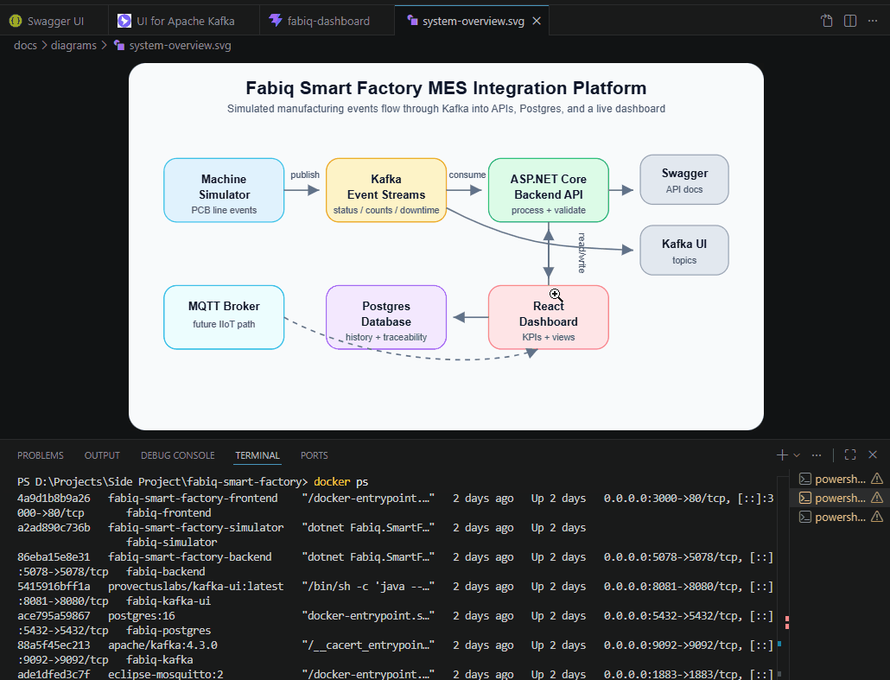

# Fabiq Smart Factory MES Integration Platform

> A production-inspired Manufacturing Execution System (MES) integration
> platform demonstrating event-driven smart manufacturing using
> **ASP.NET Core**, **Apache Kafka**, **PostgreSQL**, **React**,
> **Docker Compose**, **Prometheus**, and **Grafana**.

------------------------------------------------------------------------

## Executive Summary

Fabiq is a full-stack smart manufacturing platform that simulates a
PCB/electronics production line and demonstrates how modern
Manufacturing Execution Systems (MES) collect, process, analyze, and
visualize shop-floor data.

Unlike a traditional CRUD application, Fabiq is built around an
event-driven architecture. Manufacturing events generated by a simulator
are streamed through Apache Kafka, processed by ASP.NET Core backend
services, persisted in PostgreSQL, and presented through a React
dashboard. The platform also extends the event pipeline with
telemetry-driven anomaly detection, health-aware container
orchestration, and observability using Prometheus and Grafana.

The project demonstrates engineering patterns commonly used in
Industrial IoT (IIoT), MES, factory automation, and smart manufacturing
platforms while remaining lightweight enough to run locally using Docker
Compose.

------------------------------------------------------------------------

## Demo Preview



The demo includes:

-   Live machine status monitoring
-   Production and work-order tracking
-   Downtime and OEE reporting
-   Part traceability
-   Kafka event streaming
-   AI maintenance alerts
-   Prometheus metrics
-   Grafana dashboards

------------------------------------------------------------------------

## System Architecture


### High-Level Architecture

    Machine Simulator
            │
            ▼
     Apache Kafka
            │
     ┌──────┴────────┐
     ▼               ▼
    Backend API   AI Anomaly Worker
     │               │
     ▼               │
     PostgreSQL ◄────┘
     │
     ▼
    React Dashboard

    Prometheus ───► Backend Metrics
    Grafana ◄────── Prometheus

### Core Components

  -----------------------------------------------------------------------
  Component                    Responsibility
  ---------------------------- ------------------------------------------
  Machine Simulator            Generates realistic manufacturing events
                               and telemetry

  Apache Kafka                 Event streaming backbone

  Backend API                  Event processing, validation, persistence
                               and REST APIs

  PostgreSQL                   Manufacturing history, OEE and
                               traceability

  AI Anomaly Worker            Detects abnormal telemetry and publishes
                               maintenance alerts

  React Dashboard              Live operations dashboard

  Prometheus                   Collects backend metrics

  Grafana                      Visualizes operational metrics
  -----------------------------------------------------------------------

------------------------------------------------------------------------

## Runtime Flow


### Manufacturing Data Flow

    Machine Simulator
            │
            ▼
    Apache Kafka
            │
            ▼
    Backend API
            │
            ▼
    PostgreSQL
            │
            ▼
    React Dashboard

### Telemetry & Alert Flow

    Telemetry
         │
         ▼
    Apache Kafka
         │
         ▼
    AI Anomaly Worker
         │
    maintenance.alerts
         │
         ▼
    Backend API
         │
         ▼
    Dashboard

------------------------------------------------------------------------

## MES Capability Overview


### Core Manufacturing Capabilities

-   Machine Status Monitoring
-   Work Order Management
-   Production Event Tracking
-   Downtime Analysis
-   Overall Equipment Effectiveness (OEE)
-   Part Traceability
-   Machine Telemetry
-   AI Maintenance Alerts
-   Health & Readiness Monitoring
-   Prometheus Metrics
-   Grafana Observability

------------------------------------------------------------------------

## Technology Stack

  Layer               Technologies
  ------------------- -------------------------------------
  Backend             ASP.NET Core, Entity Framework Core
  Frontend            React, Vite
  Messaging           Apache Kafka, MQTT
  Database            PostgreSQL
  AI Processing       .NET Background Worker
  Infrastructure      Docker Compose
  Observability       Prometheus, Grafana
  API Documentation   Swagger / OpenAPI

------------------------------------------------------------------------

## Project Highlights

-   Event-driven MES architecture
-   Dockerized local development
-   Kafka-based manufacturing event streaming
-   Production KPI dashboard
-   OEE & downtime analytics
-   Part-level traceability
-   AI-assisted anomaly detection
-   Health-aware service startup
-   Automated Kafka topic initialization
-   CI-ready project structure

------------------------------------------------------------------------

## Quick Start

``` bash
git clone https://github.com/parthoece/fabiq-smart-factory.git
cd fabiq-smart-factory
docker compose up -d --build
```

Services:

-   Dashboard → http://localhost:3000
-   Backend API → http://localhost:5078/swagger
-   Health → http://localhost:5078/health
-   Kafka UI → http://localhost:8081
-   Prometheus → http://localhost:9090
-   Grafana → http://localhost:3001

For complete setup instructions see **RUN.md**.

------------------------------------------------------------------------

## Repository Layout

``` text
backend/
frontend/
machine-simulator/
ai-anomaly-service/
database/
infra/
mqtt/
scripts/
docs/
```

------------------------------------------------------------------------

## Documentation

  Document                  Purpose
  ------------------------- -----------------------------
  docs/architecture.md      System architecture
  docs/runtime-flow.md      Runtime sequence
  docs/deployment.md        Local deployment
  docs/api-reference.md     REST APIs
  docs/kafka-topics.md      Kafka event contracts
  docs/troubleshooting.md   Troubleshooting
  docs/technical-faq.md     Engineering FAQ
  docs/demo-guide.md        Demo walkthrough
  docs/portfolio.md         Portfolio & interview notes
  docs/roadmap.md           Project roadmap

------------------------------------------------------------------------

## Roadmap

### Completed

-   Event-driven backend
-   Kafka messaging
-   PostgreSQL persistence
-   React dashboard
-   OEE reporting
-   Traceability
-   AI anomaly detection
-   Prometheus & Grafana
-   Docker Compose orchestration
-   Health checks

### Planned

-   OPC UA integration
-   PLC connectivity
-   Authentication & RBAC
-   Kubernetes deployment
-   Predictive ML models
-   Cloud deployment

------------------------------------------------------------------------

## License

Licensed under the MIT License. See `LICENSE` for details.
