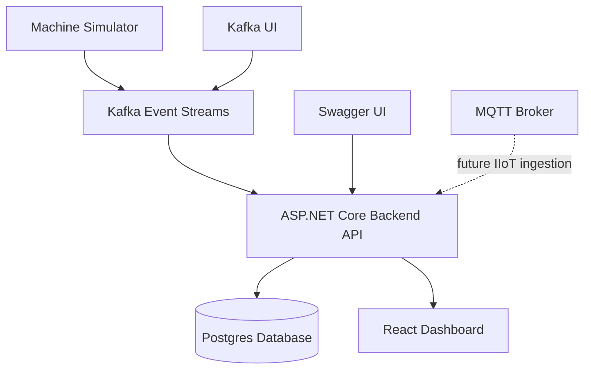
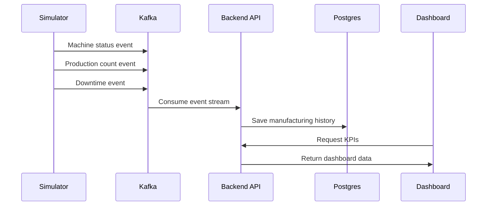
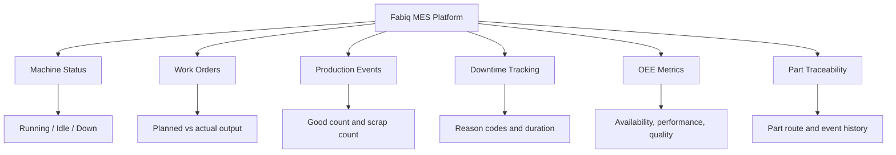
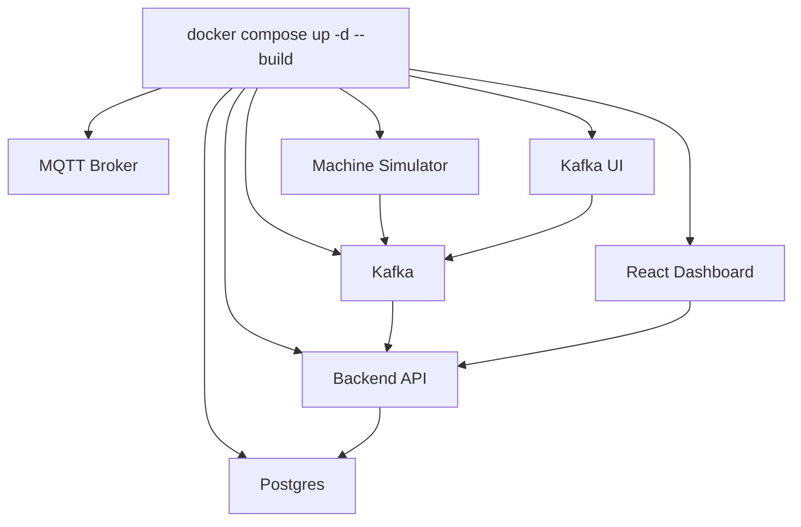
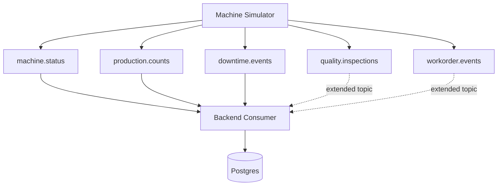
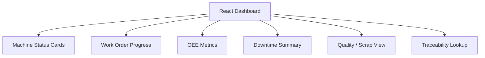
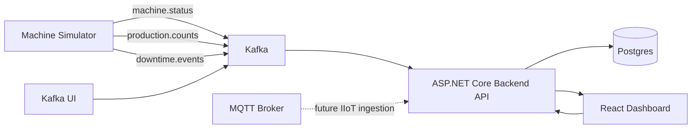

# Fabiq — Smart Factory MES Integration Platform

**Version:** `v1.0.0 Portfolio MVP`  
**Status:** Portfolio demo / local development project  
**Domain:** Smart Manufacturing, MES, IIoT, OEE, Traceability

A full-stack smart manufacturing demo that simulates a PCB/electronics production line, streams machine events through Kafka, stores manufacturing history in Postgres, and visualizes live shop-floor KPIs in a React dashboard.

This project was built to demonstrate practical software engineering for smart factory, MES, IIoT, and manufacturing integration roles.

---

## Visual Overview

This project demonstrates a smart factory MES-style integration platform for a simulated PCB/electronics production line.

The main idea is simple:

```text
Machine Events → Kafka → Backend API → Postgres → React Dashboard
```

---

### System Architecture



The simulator generates shop-floor-style events. Kafka carries those events to the backend. The backend processes and stores the data in Postgres. The React dashboard shows live manufacturing KPIs.

---

### Runtime Data Flow



This shows the end-to-end path from simulated machine activity to dashboard visibility.

---

### MES Feature Areas



The project covers common MES concepts: machine state, work orders, production output, downtime, OEE, quality, and traceability.

---

### Docker Compose Local Demo



The full demo runs locally with Docker Compose.

---

### Kafka Topics



The local MVP focuses mainly on machine status, production counts, and downtime events.

---

### Dashboard Views



The dashboard turns backend manufacturing data into views that are easy to track by operators.


## Index

1. [Project Overview](#1-project-overview)
2. [Demo Preview](#2-demo-preview)
3. [Quick Guide: Run the Local Demo](#3-quick-guide-run-the-local-demo)
4. [Detailed Reproduction Guide](#4-detailed-reproduction-guide)
5. [Manufacturing Scenario](#5-manufacturing-scenario)
6. [Architecture](#6-architecture)
7. [Runtime Flow](#7-runtime-flow)
8. [Tech Stack](#8-tech-stack)
9. [Repository Layout](#9-repository-layout)
10. [Core Features](#10-core-features)
11. [API Highlights](#11-api-highlights)
12. [Kafka Topics](#12-kafka-topics)
13. [Demo Script](#13-demo-script)
14. [Technical FAQ](#14-technical-faq)
15. [Current Status](#15-current-status)
16. [Future Improvements](#16-future-improvements)
17. [Portfolio Positioning](#17-portfolio-positioning)
18. [Resume Summary](#18-resume-summary)
19. [License](#19-license)

---

## 1. Project Overview

The **Fabiq Smart Factory MES Integration Platform** is a lightweight MES-style system for a simulated electronics manufacturing line.

The system demonstrates how manufacturing data can move from shop-floor-style event producers into a backend service, database, and dashboard.

At a high level:

- A machine simulator generates live manufacturing events.
- Kafka carries event streams between the simulator and backend.
- The backend validates, processes, and stores events.
- Postgres keeps production history and traceability data.
- The frontend displays machine status, production output, downtime, quality, OEE, and traceability views.

The goal is not to build a production-ready MES. The goal is to show the architecture, data flow, and engineering decisions behind a realistic smart factory integration platform.

---

## 2. Demo Preview

> Add screenshots after running the project locally.

Recommended screenshot folder:

```text
docs/screenshots/
```

### Dashboard


### Machine Status View


### OEE / Downtime / Quality View


### Traceability View


### Kafka UI


### Swagger API


---

## 3. Quick Guide: Run the Local Demo

This is the fastest way to run the project for a portfolio demo.

For full clean-machine setup, manual backend/frontend/simulator commands, troubleshooting notes, and rebuild steps, see [`RUN.md`](RUN.md).

### 3.1 Install Prerequisites

Install:

- Docker Desktop with Docker Compose
- .NET 8 SDK
- Node.js 22 or newer
- npm

### 3.2 Clone the Repository

```bash
git clone https://github.com/parthoece/fabiq-smart-factory.git
cd fabiq-smart-factory
cd fabiq-smart-factory
```

### 3.3 Start the Full Stack

```bash
docker compose up -d --build
```

This starts the local demo stack:

- Postgres
- Kafka
- Kafka UI
- MQTT broker
- ASP.NET Core backend API
- Machine simulator
- React frontend dashboard

### 3.4 Open the Demo

- Frontend dashboard: `http://localhost:3000`
- Backend Swagger API: `http://localhost:5078/swagger`
- Kafka UI: `http://localhost:8081`

### 3.5 Stop the Demo

```bash
docker compose down
```

---

## 4. Detailed Reproduction Guide

For a complete rebuild from scratch, refer to:

```text
RUN.md
```

The detailed guide includes:

- Required software
- Full Docker Compose startup
- Service verification
- Backend local run commands
- Simulator local run commands
- Frontend local run commands
- Optional build and lint checks

Use this README for the project overview. Use `RUN.md` when reproducing the project on a new machine.

---

## 5. Manufacturing Scenario

The demo simulates **Line A**, a PCB/electronics assembly process:

1. `SMT-01` — surface-mount production
2. `AOI-01` — automated optical inspection
3. `ASSEMBLY-01` — assembly process
4. `TEST-01` — functional test
5. `PACKING-01` — final packing

The simulator continuously emits events such as:

- Machine status updates
- Production count events
- Scrap or defect events
- Downtime events
- Work-order-related activity

These events are used to calculate operational metrics and support traceability.

---

## 6. Architecture



### 6.1 Architecture Summary

The project uses an event-driven design to better reflect how manufacturing systems receive data.

The simulator represents shop-floor equipment or an integration gateway. Kafka acts as the event backbone. The backend consumes and processes events, then stores operational history in Postgres. The frontend dashboard reads from backend APIs to show live production visibility.

This structure separates data generation, event transport, business logic, persistence, and visualization.

---

## 7. Runtime Flow

1. Docker Compose starts the infrastructure and application services.
2. Postgres becomes the manufacturing data store.
3. Kafka becomes the event streaming backbone.
4. MQTT is available as an IIoT-style ingestion broker.
5. The backend starts and exposes REST APIs.
6. The simulator seeds initial machines and work orders.
7. The simulator emits machine, production, scrap, and downtime events.
8. Kafka carries the events to the backend.
9. The backend validates and persists events in Postgres.
10. The React frontend polls the backend APIs and displays live manufacturing KPIs.

---

## 8. Tech Stack

| Area | Technology |
|---|---|
| Backend | ASP.NET Core, Entity Framework Core |
| Frontend | React, Vite |
| Database | Postgres |
| Messaging | Kafka, MQTT |
| Infrastructure | Docker Compose |
| API Documentation | Swagger / OpenAPI |
| Domain Concepts | MES, OEE, downtime, quality, traceability, smart manufacturing |

---

## 9. Repository Layout

```text
backend/Fabiq.SmartFactory.Api/Fabiq.SmartFactory.Api
  ASP.NET Core backend, EF Core models, Kafka ingestion, domain services, and REST APIs

frontend/fabiq-dashboard
  React + Vite dashboard for live manufacturing KPIs

machine-simulator/Fabiq.SmartFactory.Simulator
  Event generator that seeds machines and simulates the production line

database/migrations
  Local Postgres bootstrap SQL

docs
  Architecture notes, project plan, interview prep, screenshots, and supporting documentation

infra
  Observability scaffolding for future Prometheus/Grafana work

mqtt
  Mosquitto broker configuration

scripts
  Helper scripts for local automation and demo setup
```

---

## 10. Core Features

### 10.1 Machine Status

Shows current machine state for the simulated production line, including machine ID, line ID, status, current work order, good count, scrap count, and last update time.

### 10.2 Work Orders

Tracks production work orders, planned quantities, good counts, scrap counts, and work-order status.

### 10.3 Production Events

Stores production activity from the simulator, including machine, work order, event type, quantity, part ID, and defect information.

### 10.4 Downtime Tracking

Records downtime events by machine, work order, reason code, duration, start time, end time, and notes.

### 10.5 OEE Calculation

Provides OEE-style metrics using availability, performance, quality, and total OEE for a line or work order.

### 10.6 Part Traceability

Allows lookup of a part ID to see its route, latest status, machine history, work order association, and related production events.

### 10.7 Dashboard

Provides a live operations view for machine status, OEE, downtime, quality, and traceability.

---

## 11. API Highlights

The backend exposes MES-style APIs for machines, work orders, production events, downtime, OEE, and traceability.

Example endpoints:

```text
GET  /api/Machines/status
POST /api/Machines/seed

GET  /api/WorkOrders
GET  /api/WorkOrders/active
GET  /api/WorkOrders/{workOrderId}
POST /api/WorkOrders/seed

GET  /api/ProductionEvents/recent
POST /api/ProductionEvents
POST /api/ProductionEvents/demo-good
POST /api/ProductionEvents/demo-scrap

GET  /api/Downtime/recent
GET  /api/Downtime/summary
POST /api/Downtime
POST /api/Downtime/demo

GET  /api/Oee/line/{lineId}
GET  /api/Oee/work-order/{workOrderId}

GET  /api/Traceability/part/{partId}
GET  /api/Traceability/work-order/{workOrderId}
```

Open Swagger locally after startup:

```text
http://localhost:5078/swagger
```

---

## 12. Kafka Topics

The project is designed around manufacturing event streams.

Main topics:

```text
machine.status
machine.telemetry
production.counts
quality.inspections
downtime.events
maintenance.alerts
workorder.events
```

The current local demo focuses on the event streams needed for machine status, production counts, and downtime.

Kafka UI is available locally at:

```text
http://localhost:8081
```

---

## 13. Demo Script

Use this flow when showing the project in a portfolio review or interview.

### 13.1 Start the System

```bash
docker compose up -d --build
```

### 13.2 Open the Main Screens

Open:

- Dashboard: `http://localhost:3000`
- Swagger: `http://localhost:5078/swagger`
- Kafka UI: `http://localhost:8081`

### 13.3 Show the Event Flow

Explain the flow:

```text
Simulator → Kafka → Backend API → Postgres → React Dashboard
```

### 13.4 Show Machine Status

Open the dashboard and show live machine status changes across the simulated line.

### 13.5 Show Kafka Topics

Open Kafka UI and show the manufacturing event topics.

### 13.6 Show API Endpoints

Open Swagger and show endpoints for:

- Machines
- Work orders
- Production events
- Downtime
- OEE
- Traceability

### 13.7 Show Traceability

Run a part traceability lookup and explain how Postgres keeps the history needed to investigate a part or work order.

### 13.8 Explain OEE

Explain how production counts, scrap, and downtime contribute to OEE-style reporting.

---

## 14. Technical FAQ

### 14.1 Why did you use Kafka?

Kafka makes the project closer to a real manufacturing integration environment. In a factory, machine events often arrive asynchronously from equipment, gateways, brokers, or external systems.

Kafka allows producers and consumers to stay decoupled while still supporting a durable event stream. The same machine event stream could later be consumed by dashboards, alerts, analytics, reporting, or long-term OEE trend services.

### 14.2 Why not just use REST between the simulator and backend?

A direct REST-only flow would work for a small demo, but it would hide the real integration problem.

Manufacturing systems often need to process independent machine events, handle asynchronous data, and support multiple downstream consumers. Kafka makes the event-driven nature of the system explicit.

### 14.3 Why did you use Postgres?

Postgres is a strong fit because the project focuses on production history and traceability.

The system needs to answer relational questions such as:

- Which work order did this part belong to?
- Which machine processed the part?
- When did scrap or downtime occur?
- How did production counts affect OEE?

A relational database is a good match for this type of queryable manufacturing history.

### 14.4 Why did you build a simulator?

The simulator makes the project demo repeatable without real factory hardware.

It stands in for production equipment by generating machine status, production count, scrap, quality, and downtime events. The goal is not to pretend the simulator is a real PLC. The goal is to demonstrate the end-to-end data pipeline.

### 14.5 How is this different from a normal CRUD dashboard?

This project is designed around event flow, not just manual data entry.

The dashboard is only the final view of a larger pipeline:

1. A simulator generates manufacturing events.
2. Kafka carries those events.
3. The backend validates and stores the data.
4. Postgres keeps production and traceability history.
5. The frontend displays live operational information.

That structure is closer to how real manufacturing software receives and processes data from machines and integration systems.

### 14.6 How would you secure the system?

For a production rollout, I would add:

- API authentication and authorization
- Role-based access control
- Service-to-service credentials
- Restricted Kafka topic access
- Restricted database permissions
- Environment-specific secrets management
- Input validation for event payloads
- Network restrictions for internal services

### 14.7 What business value does this project demonstrate?

The project demonstrates how a manufacturing team could gain live visibility into:

- Line status
- Machine status
- Production output
- Downtime
- Scrap and quality
- OEE
- Part traceability
- Work-order progress

It shows both the current state of the line and the historical data needed to investigate production issues.

---

## 15. Current Status

Current portfolio MVP status:

- Docker-based local demo is available.
- Simulator-driven event flow is implemented.
- Backend APIs support the current dashboard/API slice.
- Frontend dashboard supports the current manufacturing KPI views.
- Machine status, work orders, production events, downtime, OEE, and traceability are represented.
- Documentation is prepared for portfolio review and interview discussion.

---

## 16. Future Improvements

Potential next steps:

- Authentication and role-based access control
- Prometheus and Grafana observability dashboards
- Long-term OEE trend reporting
- Shift-based production reports
- MTBF and MTTR calculations
- Alerting for downtime thresholds
- More realistic machine telemetry
- Event idempotency and ordering guarantees
- Deployment profiles for development, test, and production
- CI pipeline for backend and frontend build checks
- Expanded MQTT ingestion path for IIoT-style devices

---

## 17. Portfolio Positioning

This project is intended to show system design, not only feature delivery.

Key points to emphasize:

- The system models a real manufacturing integration pattern.
- The architecture separates event generation, event streaming, backend processing, persistence, and visualization.
- Kafka demonstrates asynchronous event flow.
- Postgres demonstrates traceable manufacturing history.
- The simulator makes the project easy to demo without specialized hardware.
- The dashboard turns backend data into operational visibility.

A concise way to describe the project:

> I built a smart factory MES-style integration platform for a simulated PCB production line. The system streams machine and production events through Kafka, stores traceable manufacturing history in Postgres, exposes ASP.NET Core APIs for OEE, downtime, quality, and part traceability, and visualizes live operations in a React dashboard.

---

## 18. Resume Summary

Built a smart factory MES integration platform using ASP.NET Core, React, Kafka, Postgres, MQTT, and Docker.

The system simulates a PCB production line, processes machine and production events, calculates OEE, tracks downtime and scrap, and provides part-level traceability through backend APIs and a live dashboard.


> Built a Dockerized smart factory MES integration platform with ASP.NET Core, React, Kafka, Postgres, and MQTT, including a simulator-driven event pipeline for machine status, production counts, downtime tracking, OEE calculation, and part-level traceability.

---

## 19. License

This project is intended for portfolio, learning, and open-source demonstration purposes.

This project is licensed under the MIT License. See the [`LICENSE`](LICENSE) file for details.


