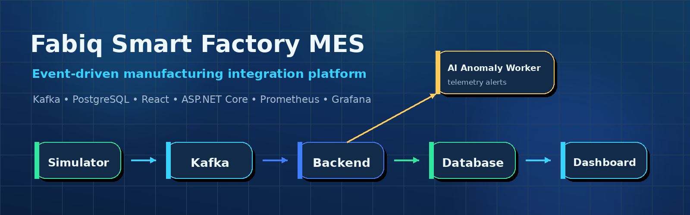
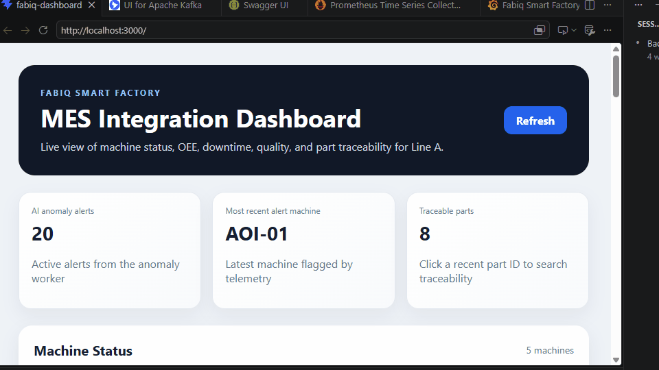
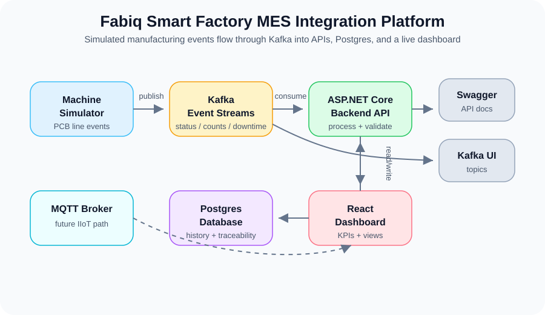
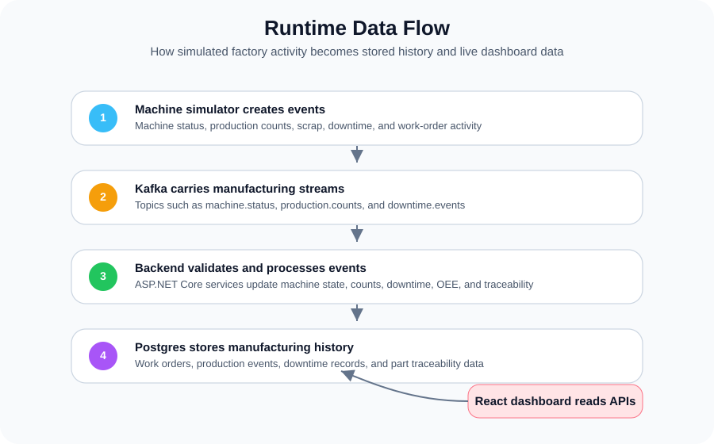
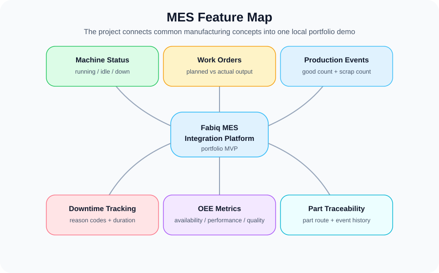

# Fabiq Smart Factory MES Integration Platform

> Production-inspired Smart Factory MES / IIoT integration platform built with **ASP.NET Core**, **React**, **Apache Kafka**, **PostgreSQL**, **Docker Compose**, **Prometheus**, and **Grafana**.

[](https://github.com/parthoece/fabiq-smart-factory/actions/workflows/ci.yml)




---

## Overview

**Fabiq** is a full-stack smart manufacturing platform that demonstrates how a modern Manufacturing Execution System (MES) can ingest, process, persist, and visualize manufacturing data.

The platform simulates a PCB / electronics production line and includes:

- Machine event simulation
- Apache Kafka event streaming
- ASP.NET Core backend services
- PostgreSQL manufacturing history
- React operational dashboard
- OEE, downtime, production, and traceability views
- AI anomaly detection worker
- Prometheus and Grafana observability
- Docker Compose orchestration

This project is intentionally positioned as a **production-inspired portfolio platform**, not a commercial MES product.

---

## Why Fabiq?

Manufacturing software is rarely just CRUD. Real shop-floor systems must process continuous events, coordinate multiple services, preserve history, support traceability, and expose operational visibility.

Fabiq demonstrates these engineering concerns through a compact but realistic architecture:

| Concern | How Fabiq Demonstrates It |
|--------|----------------------------|
| Shop-floor event flow | Machine simulator publishes manufacturing events |
| Event-driven integration | Kafka decouples producers and consumers |
| MES data persistence | PostgreSQL stores production, downtime, work orders, and traceability |
| Operational KPIs | Backend calculates OEE and exposes dashboard APIs |
| AI extension | Anomaly worker consumes telemetry and emits maintenance alerts |
| Observability | Prometheus and Grafana monitor platform behavior |
| Local reproducibility | Docker Compose runs the full platform |

---

## Demo Preview



```text
Machine Simulator
      │
      ▼
Apache Kafka
      │
      ├── Backend API ───► PostgreSQL ───► React Dashboard
      │
      └── AI Anomaly Worker ───► maintenance.alerts ───► Backend API

Prometheus ───► Backend Metrics ───► Grafana
```

---

## Architecture



Fabiq uses an event-driven architecture where manufacturing events are transported through Kafka and consumed by independent services.

See the full architecture guide:

- [Architecture](docs/architecture.md)
- [Runtime Flow](docs/runtime-flow.md)
- [Kafka Topics](docs/kafka-topics.md)
- [Design Decisions](docs/design-decisions.md)

---

## Runtime Flow



Main runtime flow:

```text
Simulator → Kafka → Backend API → PostgreSQL → React Dashboard
```

AI alert flow:

```text
Telemetry → Kafka → AI Anomaly Worker → maintenance.alerts → Backend API → Dashboard
```

---

## MES Capability Map



| Capability | Status |
|-----------|--------|
| Machine status monitoring | Implemented |
| Work order management | Implemented |
| Production event processing | Implemented |
| Downtime tracking | Implemented |
| OEE calculation | Implemented |
| Part traceability | Implemented |
| Maintenance alerts | Implemented |
| AI anomaly detection | Implemented |
| Prometheus metrics | Implemented |
| Grafana dashboards | Implemented |
| Authentication / RBAC | Planned |
| OPC UA / PLC integration | Planned |
| Kubernetes deployment | Planned |

---

## Technology Stack

| Layer | Technology |
|------|------------|
| Backend | ASP.NET Core 8 |
| Frontend | React, Vite |
| Messaging | Apache Kafka |
| Database | PostgreSQL |
| AI Worker | .NET Worker Service |
| Observability | Prometheus, Grafana |
| Containerization | Docker Compose |
| API Docs | Swagger / OpenAPI |
| Local Scripts | PowerShell |

---

## Services

| Service | Default URL |
|--------|-------------|
| React Dashboard | http://localhost:3000 |
| Backend API | http://localhost:5078 |
| Swagger UI | http://localhost:5078/swagger |
| Health | http://localhost:5078/health |
| Readiness | http://localhost:5078/ready |
| Metrics | http://localhost:5078/metrics |
| Kafka UI | http://localhost:8081 |
| Prometheus | http://localhost:9090 |
| Grafana | http://localhost:3001 |

---

## Quick Start

### 1. Clone the repository

```bash
git clone https://github.com/parthoece/fabiq-smart-factory.git
cd fabiq-smart-factory
```

### 2. Start the full platform

```bash
docker compose up -d --build
```

### 3. Verify services

```bash
docker compose ps
```

### 4. Open the dashboard

```text
http://localhost:3000
```

### 5. Stop the platform

```bash
docker compose down --remove-orphans
```

For detailed setup instructions, see [RUN.md](RUN.md) and [Deployment Guide](docs/deployment.md).

---

## Kafka Topics

| Topic | Producer | Consumer | Purpose |
|------|----------|----------|---------|
| `machine.status` | Simulator | Backend API | Machine state changes |
| `production.counts` | Simulator | Backend API | Production output |
| `downtime.events` | Simulator | Backend API | Downtime tracking |
| `machine.telemetry` | Simulator | AI Anomaly Worker | Equipment telemetry |
| `maintenance.alerts` | AI Anomaly Worker | Backend API | Maintenance notifications |

See [Kafka Topics](docs/kafka-topics.md).

---

## API Overview

The backend exposes REST APIs grouped by manufacturing domain:

| Area | Example Endpoint |
|-----|------------------|
| Machines | `GET /api/Machines/status` |
| Work Orders | `GET /api/WorkOrders` |
| Production Events | `GET /api/ProductionEvents/recent` |
| Downtime | `GET /api/Downtime/recent` |
| OEE | `GET /api/Oee/line/{lineId}` |
| Traceability | `GET /api/Traceability/part/{partId}` |
| Platform | `GET /health`, `GET /ready`, `GET /metrics` |

See:

- [API Reference](docs/api-reference.md)
- [OpenAPI Spec](docs/openapi/openapi.json)

---

## Repository Structure

```text
fabiq-smart-factory/
├── .github/
├── ai-anomaly-service/
├── backend/
├── database/
├── docs/
│   ├── assets/
│   │   ├── hero-banner.png
│   │   ├── social-preview.png
│   │   ├── demo.gif
│   │   ├── architecture-cover.png
│   │   └── feature-overview.png
│   ├── diagrams/
│   ├── openapi/
│   │   └── openapi.json
│   ├── releases/
│   │   └── v1.0.0.md
│   └── screenshots/
├── frontend/
├── infra/
├── machine-simulator/
├── mqtt/
├── scripts/
├── docker-compose.yml
├── README.md
├── RUN.md
├── CHANGELOG.md
├── CONTRIBUTING.md
├── SECURITY.md
└── CODE_OF_CONDUCT.md
```

---

## Documentation

| Document | Purpose |
|----------|---------|
| [RUN.md](RUN.md) | Quick local setup guide |
| [Architecture](docs/architecture.md) | System architecture and service responsibilities |
| [Runtime Flow](docs/runtime-flow.md) | Startup sequence and runtime behavior |
| [Deployment](docs/deployment.md) | Local deployment instructions |
| [API Reference](docs/api-reference.md) | REST API overview |
| [Kafka Topics](docs/kafka-topics.md) | Event topic reference |
| [Troubleshooting](docs/troubleshooting.md) | Operational troubleshooting guide |
| [Technical FAQ](docs/technical-faq.md) | Engineering rationale and trade-offs |
| [Design Decisions](docs/design-decisions.md) | Architecture decision records |
| [Demo Guide](docs/demo-guide.md) | Interview and portfolio demo flow |
| [Portfolio Guide](docs/portfolio.md) | Resume and interview positioning |
| [Roadmap](docs/roadmap.md) | Completed and planned milestones |
| [Release Notes](docs/releases/v1.0.0.md) | v1.0.0 release notes |

---

## Development Commands

Start the platform:

```bash
docker compose up -d --build
```

View services:

```bash
docker compose ps
```

View backend logs:

```bash
docker logs fabiq-backend --tail=100
```

Reset local environment:

```bash
docker compose down --remove-orphans -v
docker compose up -d --build
```

Validate compose file:

```bash
docker compose config
```

---

## Project Status

| Area | Status |
|------|--------|
| Event-driven architecture | Complete |
| Backend APIs | Complete |
| Manufacturing simulator | Complete |
| Kafka integration | Complete |
| Dashboard | Complete |
| OEE and traceability | Complete |
| AI anomaly detection | Complete |
| Observability | Complete |
| Documentation | Complete |
| GitHub community files | Complete |
| CI workflow | Complete |
| Authentication / RBAC | Planned |
| OPC UA integration | Planned |
| Kubernetes deployment | Planned |

---

## Roadmap

Planned future enhancements include:

- Authentication and Role-Based Access Control
- OPC UA / PLC connectivity
- Kafka Schema Registry
- Event versioning
- Shift reporting
- MTBF / MTTR metrics
- Quality inspection workflows
- Kubernetes deployment
- Predictive maintenance models
- Digital Twin integration

See [Roadmap](docs/roadmap.md).

---

## Contributing

Contributions, suggestions, and documentation improvements are welcome.

Before contributing, read:

- [Contributing Guide](CONTRIBUTING.md)
- [Code of Conduct](CODE_OF_CONDUCT.md)
- [Security Policy](SECURITY.md)

---

## Release

Current release:

```text
v1.0.0 — Initial Public Release
```

See:

- [Changelog](CHANGELOG.md)
- [Release Checklist](RELEASE_CHECKLIST.md)
- [v1.0.0 Release Notes](docs/releases/v1.0.0.md)

---

## License

This project is licensed under the MIT License.

See [LICENSE](LICENSE).

---

## Portfolio Positioning

Fabiq demonstrates backend engineering, event-driven architecture, manufacturing domain modeling, observability, containerized deployment, and AI-assisted anomaly detection in a smart factory context.

It is designed to support interviews and portfolio discussions for roles such as:

- Backend Software Engineer
- Manufacturing Software Engineer
- MES Engineer
- Industrial IoT Engineer
- Platform Engineer
- Automation Software Engineer