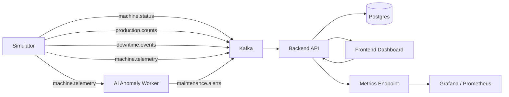

# Project Architecture

## High-Level Flow

## Repository Layout

- `backend/Fabiq.SmartFactory.Api/Fabiq.SmartFactory.Api` - API host, controllers, data access, EF Core models, Kafka consumer, and domain services
- `frontend/fabiq-dashboard` - React + Vite dashboard
- `machine-simulator/Fabiq.SmartFactory.Simulator` - local event generator and Kafka producer
- `ai-anomaly-service/Fabiq.SmartFactory.AnomalyWorker` - telemetry consumer and maintenance alert producer
- `database/migrations` - database bootstrap SQL used by Docker Compose
- `docs` - architecture, OpenAPI, and the project plan
- `infra` - Prometheus and Grafana provisioning assets
- `mqtt` - Mosquitto configuration
- `scripts` - utility scripts for demo startup, seeding, smoke checks, and reset

## Runtime Components

- Postgres stores machines, work orders, production events, and downtime events.
- Kafka carries simulated manufacturing events between producer and consumer.
- The backend validates and persists incoming events, then serves dashboard APIs.
- The anomaly worker consumes telemetry, detects outliers, and persists maintenance alerts.
- Prometheus scrapes the backend metrics endpoint for event counters.
- Grafana visualizes the counters using the provisioned datasource and dashboard.
- The frontend polls the backend for live dashboard data.
- The simulator seeds initial data and drives the production line continuously.

## Startup Order

1. Start Docker services: Postgres, Kafka, Kafka UI, MQTT.
2. Start the backend API and anomaly worker.
3. Start Prometheus and Grafana.
4. Start the simulator.
5. Start the frontend.

The Docker Compose file now handles this full path for the local demo.